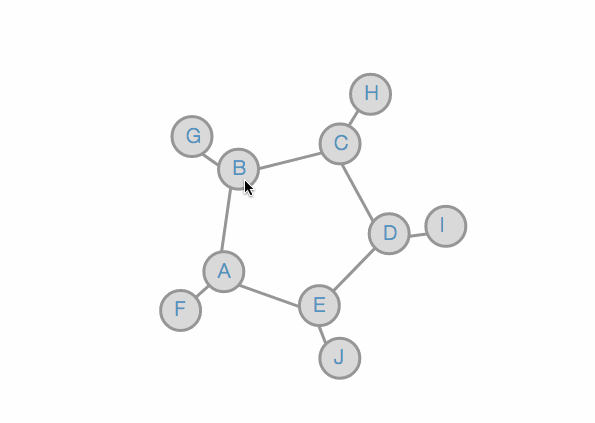

# a3-software-design
INFO474 - Data visualization: Making reusable d3.js charts

This module helps you make network visualizations. These are excellent to show relationships between entities. An example is shown below.  




## Prepping the Data 
There are two types of information encoded. The individual nodes present in the visualization and the relationships between them. You have to pass in a JSON object with a list of nodes and links as in the following: 

```
{
  "nodes": [
    {
      "id": 1,
      "name": "A"
    },
    {
      "id": 2,
      "name": "B"
    },
    {
      "id": 3,
      "name": "C"
    },
  ],
  
  "links": [
    {
      "source_id": 1,
      "target_id": 2
    },
    {
      "source_id": 1,
      "target_id": 5
    },
    {
      "source_id": 1,
      "target_id": 6
    },
  ]
}
```
>
**Protip** : There's two different types of arrays in the above object. While prepping your data, you can create the `node` and `links` arrays seperately and combine them with:  
```
var graph = {"nodes": nodes,"links": links};
```  
And to check if you prepped the data correctly, use:  
```
console.log(JSON.stringify(graph, null, 4));
```

## Building the visualization

### Setting dimensions
In the following, the nodes refer the circles and links refer to the lines connecting them. You can set these attributes with `net.<dimension>(<value>);`

RGB values may be specified as `"#ff0000"` or `"rgb(255, 0, 0)"`
Pixel values may be specified as `960` or `"2px"`
The chart has the following attributes. The default values and the descriptions are shown next to the property names.   

- **`width`** = 960
> Width of the chart in pixels. 
- **`height`** = 500
> Height of the chart in pixels. 
- **`linkStroke`** = "#969696"
> Color of the links between the nodes. Takes in hexadecimal RGB value.
- **`linkStrokeWidth`** = '3px'
> Thickness of the links between nodes in pixels. 
- **`nodeRadius`** = 20
> Radius of the node circles in pixels. 
- **`nodeFill`** = "#d9d9d9"
> Color of the nodes in hexadecimal RGB value.
- **`nodeStroke`** = "#969696"
> Color of the border of the nodes as an RGB value.
- **`nodeStrokeWidth`** = "2px"
> Thickness of the border of the nodes in pixels.
- **`fontSize`** = '20px'
> Font size of the text on the nodes in pixels.
- **`textFill`** = "#4393c3"
> Color of the text on the nodes. 

### Rendering the graph
```
var net = network();
net.width(600).height(500);
net(svg, graph);
```
